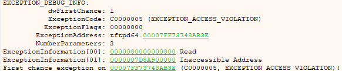

# TFTPD64_DOS

By sending a large DNS request similar to the one in the repository the application terminates causing DoS. 
The issue is related to an invalid values being passed to rep movsb.

PoC as Python

v4.64 which as of writing is the latest release is affected.

Note that DNS is enabled by default!

